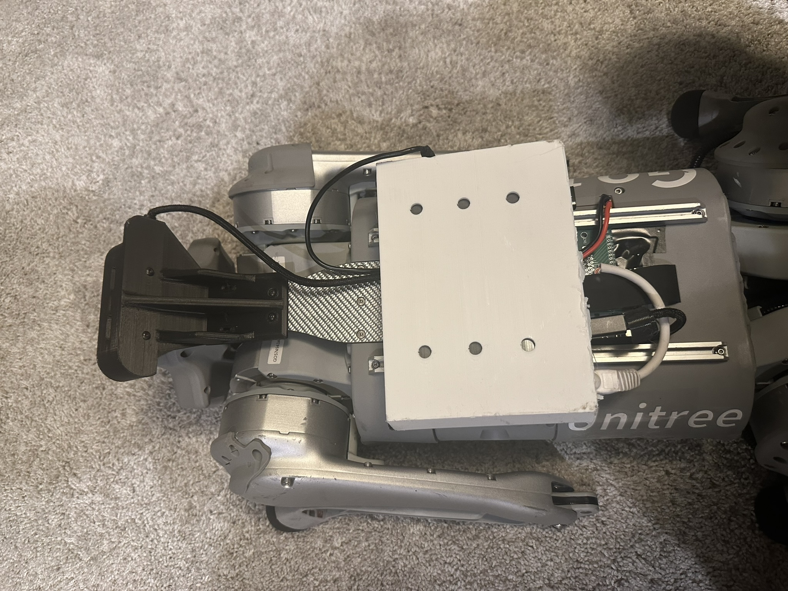
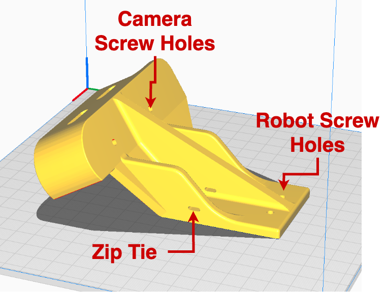

Real Robot Deployment Setup
===========================
This section describes our real robot setup to deploy the trained policies.
The following setup have been tested on our Unitree Go1 robot.
You may want to customize the process to suit your requirements.

.. note::

   Real robot experiments, especially those involving highly dynamic motions, can be **dangerous**. Always ensure proper human and environment protection before any experiment, and always keep an e-stop in hand.

Hardware Preparation
--------------------

We use an Intel `Realsense D435i <https://www.intelrealsense.com/depth-camera-d435i/>`_ camera to capture onboard depth images, and use a modified Mac Mini computer with M1 processor for power-efficient onboard processing. Both the camera and the computer are powered by the robot battery. The complete setup looks like the picture above.

1. Mount the Depth Camera
^^^^^^^^^^^^^^^^^^^^^^^^^

To mount the camera, 3D print the :download:`camera mount file <../../data/camera_mount.STL>` and use the two screw holes to attach it to the front of the robot. You may use zipties to further secure the mount to the robot.

For rapid terrain response, we use the 90Hz frame rate for depth images, which is only supported by a USB3.0 or higher. Therefore, please use a compatiable cable (USB3.0+, usually identified by its thickness) to connect the camera to the computer.

2. Prepare Remote Estop
^^^^^^^^^^^^^^^^^^^^^^^

**Note**: You can modify `src/robots/gamepad_reader.py` to set up a different gamepad with a different protocol. You can even override this file to disable the estop completely. However, we **highly recommend** using a estop for safety concerns.

We use a Sony `Dualshock 4 <https://www.playstation.com/en-us/accessories/dualshock-4-wireless-controller/>`_ Bluetooth Joystick as the remote Estop. It has a few benefits including reliable and automatic bluetooth connection, working status indicator, decent battery life, and high robustness.

We find the computer's default bluetooth chip does not work well with the joystick, and use the following `bluetooth adaptor <https://www.amazon.com/gp/product/B09DMP6T22/ref=ppx_yo_dt_b_search_asin_title?ie=UTF8&psc=1>`_ instead.

Please see this `guide <https://www.playstation.com/en-us/support/hardware/ps4-pair-dualshock-4-wireless-with-pc-or-mac/>`_ for pairing the joystick to the computer.
If configured and paired properly, the joystick should connect automatically to the computer once it power on, with the status light showing a solid blue.

3. Mount and Connect the Mac Mini
^^^^^^^^^^^^^^^^^^^^^^^^^^^^^^^^^

Though our code is compatiable with most computing platforms, we choose a modified Mac Mini with M1 processor for all computing requirements. We choose the Mac Mini because:

1. The processor can perform heavy computation (e.g. running our ConvNet at 200+Hz) with little power consumption (<30w).
2. Can be powered using onboard DC power supply.
3. Easy and robust integration of WiFi, bluetooth, USB3.0, etc.

To customize a Mac Mini hardware from open-box, perform the following steps:

1. Get a M1 Mac Mini. The M2 / later generations should work too but requires re-design of the mounting hardware.

2. Follow `this guide <https://www.printables.com/model/139893-shrink-the-m1-mac-mini>`_ to reduce the size and weight of the Mac Mini. We perform two more modifications on top of this guide:

 a) We use another `DC Power Regulator <https://www.amazon.com/gp/product/B07V8K6YZ6/ref=ppx_yo_dt_b_search_asin_title?ie=UTF8&psc=1>`_ to convert the battery input voltage to 12V. If you strip off all the casing, the power regulator is quite small and can fit inside the shell as well.

 b) Instead of the Magsafe connector, we use a different 5.5mm-2.5mm connector to connect the computer to robot power. Any reliable DC connector would work.

3. Print the :download:`computer mount <../../data/mac_mini_mount.stl>`. If you refer to the picture on top of this page, the mount is the white casing with 6 round holes on top. Insert two M3 heat inserts so that the "lid" can be attached to the main body.

.. image:: images/mac_mini_mount.png
   :alt: Hardware Setup
   :scale: 50 %
   :align: center

**Note**: if the robot falls, this is the last layer of protection for the computer. Be sure to print using a sturdy material (PLA+, PETG, or stronger) and use an appropriate printing setup.

4. Install the computer mount by sliding it into the aluminum track. You can slide the computer forward/backward before tightening the tracks. We received the aluminum tracks from Unitree when we purchased the robot. Contact the reseller if you don't have the tracks.

5. Connect the following 3 cables:
a) One power cable from robot's battery output to the Mac Mini.
b) One ethernet cable from the robot to the Mac Mini (white cable in picture).
c) One USB3.0+ cable from the camera to the Mac Mini.

Robot Preparation
-----------------
**Disable Unitree's default controller**

By default, the Go1 robot enters `sport` mode and executes the default controller program at start-up. To avoid interferences, make sure to disable Unitree's default controller before running any custom control code on the real robot.

    * You can disable the default controller temporarily by pressing L2+B on the remote controller once the robot stands up, or permanently (**recommended**) by renaming the controller executable on the robot computer with IP `192.168.123.161`.
    * After disabling the default controller, the robot should **not** stand up and should stay in motor damping mode.

Mac Mini Software Setup
-----------------------

1. Installing Asahi-Linux
^^^^^^^^^^^^^^^^^^^^^^^^^
Follow the guide on `Asahi Linux <https://asahilinux.org/>`_ to install Fedora on the Mac Mini.
This allows us to set up all software packages in a pseudo-linux environment.
While the initial setup can be bulky, we find the resulting system to be smooth and reliable, and sometimes perform better than the original Mac OS.

**Note**: if you decide to use Mac Mini for any robotics projects, we highly recommend Asahi Linux, a very convenient platform.

2. Install ROS
^^^^^^^^^^^^^^
Follow the `Robostack Guide <https://robostack.github.io/GettingStarted.html#installation-ros>`_ to create a virtual environment and install **ROS1 Noetic** to the Mac Mini. You would also want to use the same virtual environment to install all python dependencies later.

3. Clone and Install Repo Dependencies
^^^^^^^^^^^^^^^^^^^^^^^^^^^^^^^^^^^^^^
Since IsaacGym does not support non-X86 computers or computers without Nvidia GPUs, we need to install a subset of packages for deployment. All packages required for deployment have been summarized. Once you have set up the conda/mamba virtual environment in the previous step, just run the following code:

.. code-block:: bash

   pip install -r deployment_requirements.txt

4. Connect Mac Mini to the real robot
^^^^^^^^^^^^^^^^^^^^^^^^^^^^^^^^^^^^^
Connect from Mac Mini to the real robot using an Ethernet cable, and set the computer's IP address to be `192.168.123.24` (or anything in the `192.168.123.X` range that does not collide with the robot's existing IPs). Make sure you can ping/SSH into the robot's computer (by default it is `unitree@192.168.123.12`).

In general, there should be two ways to connect to the Mac Mini during robot operation:

 1. Room WiFi

 If the Mac Mini is already connected to the lab wifi, any computer on the same network should be able to SSH into it. This is the preferred way of computer connection for lab testing, as you can easily transfer data from/to the Mac Mini, and upgrade/modify any software.

 2. Robot WiFi

 If you are testing the robot in outdoor environment without known wifi connection, you can still connect to the Mac Mini using the robot's built-in wifi hotspot. Once the robot is powered on, connect to the robot hotspot named `Unitree_GoXXX` and perform a 2-step SSH. First SSH onto the Rapberry Pi `pi@192.168.12.1` and then SSH from the Raspberry Pi to the Mac Mini on `username@192.168.123.XX`, where XX is the address you set up in the previous section.

5. Test connection
^^^^^^^^^^^^^^^^^^

Start up the robot and make sure the robot is in joint-damping mode. Then, run the following:

.. code-block:: bash

   python -m src.robots.go1_robot_exercise_example --use_real_robot=True --use_gpu=False --num_envs=1

The robot should be moving its body up and down following a pre-set trajectory. Terminate the script at any time to bring the robot back to joint-damping position.

Running the Demo Policy
---------------------

We provide a demo policy of stair jumping. To run the policy, first start the depth image stream by running the following on a terminal window:

.. code-block:: bash

   supervisord -c src/configs/supervisord.conf

This starts the `roscore` process and another python process to stream the normalized depth images. You can verify the image stream by checking `rostopic echo /camera/depth/cnn_input`, and its rate by checking `rostopic hz /camera/depth/cnn_input`.

Then, lie the robot flat on the ground, and execute the policy on *another* terminal window:

.. code-block:: bash

   python -m src.agents.heightmap_prediction.eval_real --policy_ckpt=data/demo_policy/stair_distill/model_29.pt

The evaluation script interacts with the joystick in the following way:
1. As a safety precaution, this script will start by checking the remote joystick. It will terminate and throw an error if no joystick is detected.

2. To make sure that the operator is holding the joystick, the script will then *vibrate* the joystick for 10 seconds and prompt for user response. To respond, press *down* the *left joystick* of the controller. Once the joystick is pressed, the robot will stand up and start a sequence of up to 10 jumps (defined in line 67 of `eval_real.py`). If no joystick press is detected in the 10 seconds, the script will terminate.

This 10 seconds of buffer time serves two purposes. First, it ensures that the operator is holding the E-stop and ready to stop the robot at any time. Second, it gives extra buffer time to set up camera, filming, mocap, etc.

3. During robot operation, you can terminate the operation at any time by pressing `L1+R1` simultaneously. That is the e-stop signal from the joystick.

Again, be sure to set out enough space and follow all the safety protocols during real robot operation!
