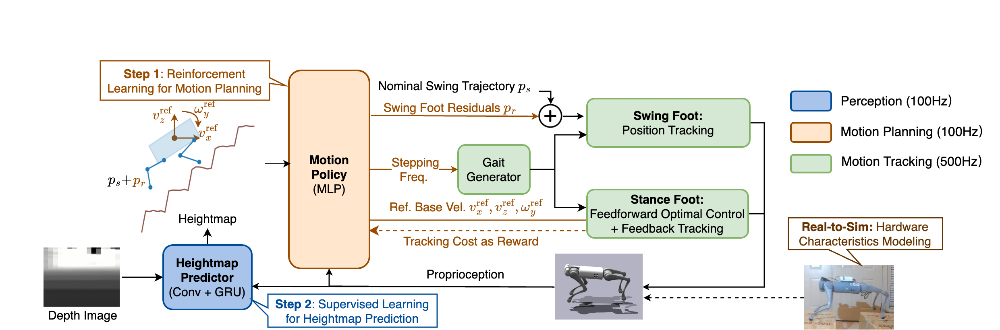

Training a New Policy
=====================

As shown in the block diagram above, our framework consists of a *Heightmap Predictor* for terrain estimation from depth images, a *Motion Policy* for terrain-adaptive motion planning, and a *Leg Controller* for motion tracking. The *Leg Controller* is a hand-designed model-based controller. The *Motion Policy* and the *Heightmap Predictor* need to be trained separately in two steps.

Configuring the Motion Policy
-----------------------------

The RL environment for motion policy training is defined in `src/envs/jump_env.py`. Other important environment-related files include:

* `src/robots/robot.py`: this file defines the simulated robot class.
* `src/controllers/`: this folder contains GPU-parallelized implementations of the low-level leg controller. Please refer to our prior `paper <https://arxiv.org/abs/2306.09557>`_ and `repo <https://github.com/yxyang/cajun/>`_ for further details.
* `src/envs/jump_env.py`: this is the main environment for RL training.
* `src/envs/terrain.py`: this file defines all terrain classes and the curriculum/terrain randomizations.

All important training configurations have been summarized to `src/envs/configs/bound_together.py`. We highlight a few important fields here:

* `config.terrain_proportions` (L26-34): this defines the proportions in which each terrain will be sampled during training. Since the stairs and stepping stones are more challenging, we recommend sampling these terrains a bit more frequently for better training exposure.
* `config.height_noise_lb` (L60-61): this defines the amount of random shifts applied to the heightmap. It is uniformly sampled between the lower and upper bound. It is sampled at the beginning of each episode and fixed for the rest of the episode.
* Action space definition (L63-75): these lines define the action space and relative ranges.
* Reward function (L113-136): defines the reward function terms and weight.

Training the Motion Policy
--------------------------

We adopt the PPO implementation from `rsl_rl <https://github.com/leggedrobotics/rsl_rl>`_ with minor modifications. The related code is in `src/agents/ppo`. To train a new motion policy using PPO, run the following command:

.. code-block:: bash

    python -m src.agents.ppo.train  --show_gui=False --config=src/agents/ppo/configs/bound_together.py --config.training.runner.experiment_name="1_demo_allterrain_ckpt" --num_envs=4096 --use_gpu=True  --logdir=logs/motion_policy

Configuring the Heightmap Predictor
-----------------------------------

The Heightmap Predictor and related training code are implemented in `src/agents/heightmap_prediction`. The main config file is `src/agents/heightmap_prediction/configs/lstm_heightmap.py`. We train the heightmap predictor using DAgger, which alternates between collecting data using the latest predictor, and training the predictor using the latest collected data. A few important fields include:

* `config.teacher_ckpt`: point this field to the checkpoint of the motion policy.
* `config.num_init_stes` and `config.num_dagger_steps`: the number of environment state-action interactions to collect in each iteration of DAgger.
* `config.num_steps`: the number of gradient steps to train the heightmap predictor.
* `config.num_iters`: the number of DAgger iterations to run.

Training the Heightmap Predictor
--------------------------------
To train a new heightmap predictor based on an existing motion policy checkpoint, set up the right configurations and then run:

.. code-block:: bash

    python -m src.agents.heightmap_prediction.train_dagger --logdir=logs/heightmap_predictor
