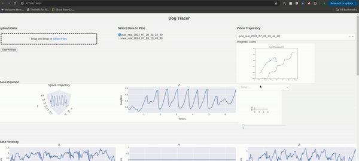

A Few Utility Tools
===================

Dog Tracer for Log Inspection
-----------------------------

In our prior work, we implemented an initial version of `dog tracer <https://github.com/yxyang/cajun/?tab=readme-ov-file#dog-tracer>`_ for inspecting proprioceptive data. In this repo, we extend the capability of dog tracer to visualize the depth image and estimated heightmap jointly with proprioception.

You can start the dog tracer by running:

.. code-block:: bash

    python -m src.utils.dog_tracer.dog_tracer

Camera Latency Calibration
--------------------------
`src/utils/go1_camera_calibration` executes sinusoidal body height motions and records the depth image as well as body proprioception data. We then use the recorded data to plot the body height estimation from camera and from proprioception, which allows us to measure perception latencies.

Motor Calibration
-----------------
`src/utils/go1_motor_calibration` executes *open-loop torque command* to the rear-left knee of the robot. We then measure the output torque and compare it with the torque command.

.. image:: images/motor_calibration.gif
   :alt: Motor Calibration
   :scale: 50 %
   :align: center
